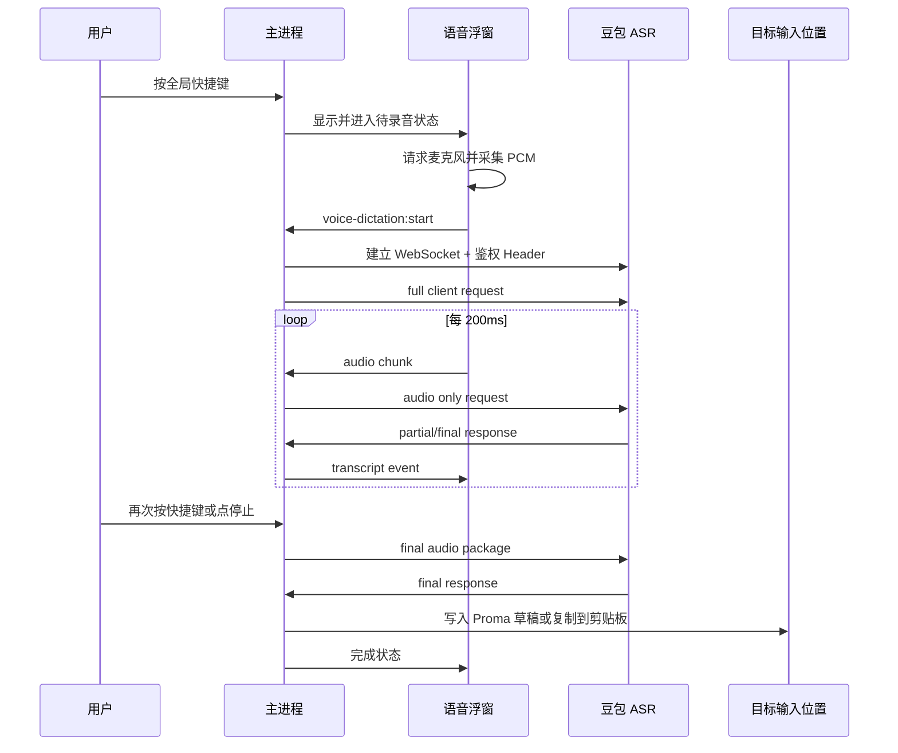

# 豆包流式语音输入 MVP 设计

## 背景

Proma 希望增加一个类似 Typeless 的系统级语音输入能力：用户安装后可以通过全局快捷键在任意应用中唤起语音输入，看到轻量浮动提示，并将语音转写结果输入到当前文本位置。区别于传统“录完再识别”，MVP 需要支持豆包的流式语音识别，让用户说话时能实时看到识别文本。

当前代码库已有几个可复用基础：

- 主进程全局快捷键服务：`apps/electron/src/main/lib/global-shortcut-service.ts`
- 快速任务浮窗：`apps/electron/src/main/lib/quick-task-window.ts` 与 `apps/electron/src/renderer/components/quick-task/QuickTaskApp.tsx`
- 设置持久化：`apps/electron/src/types/settings.ts` 与 `apps/electron/src/main/lib/settings-service.ts`
- Chat / Agent 输入框草稿基于 Jotai，并使用 `RichTextInput` 作为受控输入组件

现有 `SpeechButton` 基于浏览器 Web Speech API，只适合应用内按钮级语音输入，不适合作为本功能基础。MVP 应新增独立的语音输入服务，而不是继续扩展该组件。

## 目标

MVP 只解决一条主路径：

1. 用户在设置里配置豆包语音识别凭证。
2. 用户按全局快捷键唤起语音输入浮窗。
3. Proma 获取麦克风音频，按 16kHz / 16-bit / mono PCM 分包发送给豆包大模型流式 ASR。
4. 浮窗实时显示 partial / final 转写结果。
5. 用户停止后，Proma 将最终文本写入目标位置。
6. 如果目标是 Proma 当前 Chat / Agent 输入框，直接写入对应草稿；否则优先通过系统粘贴写入当前光标位置，失败时保留到剪贴板。

## 非目标

以下能力暂不进入 MVP：

- 按住说话、松开停止的 push-to-talk。Electron `globalShortcut` 原生更适合 tap-to-toggle，监听全局 keyup 需要额外原生 hook，先不增加打包复杂度。
- AI 润色、自动去口癖、翻译、语气改写。
- 语音输入历史记录。
- 多供应商 STT 抽象。
- 离线识别。
- 外部应用中边说边实时改写当前输入框。MVP 只在浮窗流式显示，停止后一次性输出最终文本。

## 豆包 ASR 接入选择

优先使用豆包“大模型流式语音识别 API”的双向流式优化版：

- Endpoint: `wss://openspeech.bytedance.com/api/v3/sauc/bigmodel_async`
- 降级 Endpoint: `wss://openspeech.bytedance.com/api/v3/sauc/bigmodel`
- 协议：WebSocket 二进制帧
- 鉴权 Header：
  - `X-Api-App-Key`
  - `X-Api-Access-Key`
  - `X-Api-Resource-Id`
  - `X-Api-Connect-Id`
- 推荐音频包：200ms 左右
- 音频格式：`pcm` / `raw` / `16000` / `16` / `1`

官方文档说明：双向流式会尽快返回识别字符，优化版只在结果变化时返回新包，性能更好。MVP 默认使用优化版，连接失败或用户显式切换时可回退普通双向流式。

参考：

- 火山引擎大模型流式语音识别 API：https://www.volcengine.com/docs/6561/1354869
- OpenTypeless 豆包 ASR 配置说明：https://www.opentypeless.com/en/docs/stt-volcengine-doubao

## 用户体验

### 设置入口

在设置中新增“语音输入”页或在“快捷键/通用”附近新增语音输入区块：

- 配置说明：
  - 打开火山引擎语音服务控制台：https://console.volcengine.com/speech/service/
  - 选择旧版服务界面
  - 找到“豆包流式语音识别模型2.0”类目
  - 选择正确的应用，并确保已主动申请对应权限
  - 在页面下方对照填写 APP ID 和 Access Token，随后点击测试连接
- 启用语音输入：开关
- 豆包 APP ID：对应 `X-Api-App-Key`
- 豆包 Access Token：对应 `X-Api-Access-Key`
- Resource ID：默认 `volc.seedasr.sauc.duration`
- 语言：默认自动；可选 `zh-CN`、`en-US` 等
- 快捷键：默认 `Ctrl+～`（反引号键），与 Typeless 的唤起方式保持一致
- 输出方式：
  - 自动：Proma 当前激活时写入当前 Chat / Agent 输入框，否则写入当前光标位置
  - 仅复制到剪贴板
  - 仅写入 Proma 输入框

凭证不复用现有豆包 LLM 渠道。现有豆包渠道使用 Ark OpenAI-compatible API Key，而 OpenSpeech ASR 使用 APP ID / Access Token / Resource ID，语义不同，应独立配置并加密存储。

### 浮窗状态

浮窗采用轻量无边框窗口，宽约 480px，默认位于屏幕上方偏下位置。窗口使用真实背景色，不使用透明背景；文本不显示滚动条，窗口高度随转写内容增长但保持在当前屏幕可用高度内，底部提示始终保留。状态包括：

- 待开始：提示快捷键、麦克风状态、当前供应商
- 连接中：显示加载状态
- 录音中：声波 / 音量条、实时文本、停止按钮
- 完成：最终文本、已写入 / 已复制提示
- 错误：错误原因、重试和复制已有文本

文案和日志使用中文，保留 ASR、WebSocket、Resource ID 等必要术语。

## 架构

### 主进程模块

新增 `apps/electron/src/main/lib/voice-dictation-window.ts`

- 预创建语音输入浮窗
- 通过全局快捷键切换显示
- 定位到鼠标所在显示器上方偏下
- 如果 Proma 不在前台，使用非激活方式显示浮窗，不主动唤起 Proma 主窗口
- 发送 `voice-dictation:shown` / `voice-dictation:hidden` 事件给浮窗 renderer

新增 `apps/electron/src/main/lib/doubao-asr-service.ts`

- 管理豆包 WebSocket 连接
- 组装二进制协议帧
- gzip 压缩请求与音频 payload
- 解析服务端 full server response / error response
- 向 renderer 推送 partial / final / error

新增 `apps/electron/src/main/lib/text-output-service.ts`

- 协调 Proma 内部写入、外部系统粘贴和剪贴板回退
- 给 Proma 内部输入框派发主窗口事件

新增 `apps/electron/src/main/lib/text-insertion-service.ts`

- 临时写入系统剪贴板
- macOS 通过辅助功能权限和 `System Events` 触发 `Cmd+V`
- Windows 通过 Win32 `SendInput` 触发 `Ctrl+V`
- 自动粘贴成功后尽量恢复用户原剪贴板
- 自动粘贴失败时保留语音文本到剪贴板

### 渲染进程模块

新增 `apps/electron/src/renderer/components/voice-dictation/VoiceDictationApp.tsx`

- 浮窗 UI
- 请求麦克风权限
- 使用 `AudioWorklet` 或等价实现采集音频
- 转 16kHz PCM s16le
- 每 200ms 通过 IPC 发送音频包给主进程
- 麦克风先于 ASR WebSocket 完成就绪；ASR 连接期间本地缓存音频，连接成功后补发，避免用户等待启动环节
- 接收 ASR 文本事件并更新 UI

状态策略：

- 浮窗录音状态、音量、临时转写文本属于独立窗口内的短生命周期状态，保留在 `VoiceDictationApp` 本地。
- Chat / Agent 草稿继续复用现有输入框状态和插入事件。
- 语音输入配置由主进程设置服务持久化到本地配置文件，设置页按需读取和保存。

新增设置组件：

- `VoiceInputSettings.tsx`

### Shared / 类型

新增类型和 IPC 常量，优先放在 Electron app 本地类型中；如果未来要复用到包级能力，再迁移到 `@proma/shared`。

建议类型：

```ts
export interface VoiceDictationSettings {
  enabled: boolean
  provider: 'doubao'
  appId?: string
  accessToken?: string
  resourceId: string
  language?: string
  endpointMode: 'async' | 'duplex'
  outputMode: 'auto' | 'clipboard' | 'proma-input'
}

export interface VoiceDictationTranscriptEvent {
  sessionId: string
  text: string
  isFinal: boolean
  utterances?: Array<{
    text: string
    definite: boolean
    startTime?: number
    endTime?: number
  }>
}
```

## 数据流



## 输出策略

MVP 输出策略采用保守实现：

1. 唤起浮窗前记录 Proma 主窗口是否是当前激活目标。
2. 如果当前活跃的是 Proma 且存在 Chat / Agent 输入框，停止后通过 IPC 发送 `voice-dictation:insert-text` 到主窗口，由 `GlobalShortcuts` 或专门监听器写入对应 Jotai 草稿。
3. 否则将最终文本临时写入剪贴板，并触发系统粘贴快捷键写入当前光标。
4. 自动粘贴成功后，如果用户没有修改剪贴板，延迟恢复原剪贴板内容。
5. 如果系统粘贴失败，保留最终文本到剪贴板，浮窗显示“自动粘贴失败，已复制到剪贴板”。

macOS 首次自动粘贴需要辅助功能权限。Proma 会在粘贴前主动触发授权提示；授权前本次输出降级为剪贴板，授权后下次即可自动粘贴。Windows 普通窗口通过 `SendInput` 发送 `Ctrl+V`，如果目标窗口以管理员权限运行，系统可能会拦截普通权限进程的输入注入。

## 权限与打包

macOS 打包需要新增麦克风权限说明：

- `NSMicrophoneUsageDescription`

MVP UI 应明确解释：麦克风用于语音识别，外部应用场景默认写入当前光标位置并以剪贴板兜底；Proma 当前激活时写入当前 Chat / Agent 输入框。

Electron 官方参考：

- `systemPreferences.getMediaAccessStatus('microphone')`
- `systemPreferences.askForMediaAccess('microphone')`
- `systemPreferences.isTrustedAccessibilityClient(prompt)`

## 依赖策略

需要新增 Node WebSocket 客户端，因为浏览器 `WebSocket` 不能设置豆包要求的自定义鉴权 Header。

候选依赖：

- `ws`
- `@types/ws`

正式安装前必须按项目规则重新搜索并确认版本。当前调研显示 `ws` 最新稳定版本在 8.x，包成熟、无运行时依赖，适合主进程使用。

不建议在 MVP 引入：

- `uiohook-napi`：可做全局 keydown / keyup，但会增加原生模块、打包、签名复杂度。
- 豆包第三方 ASR SDK：协议不复杂，自研轻量实现更可控，也更方便日志与错误处理。

## 错误处理

错误分层：

- 配置错误：缺少 APP ID / Access Token / Resource ID。
- 权限错误：麦克风未授权。
- 网络错误：WebSocket 建连失败、连接中断、超时。
- 协议错误：豆包 error response，显示错误码与简短信息。
- 音频错误：无音频输入、采样失败、音频格式不符合要求。
- 输出错误：Proma 内部写入不可用时，保留剪贴板回退。

日志策略：

- 主进程记录 `X-Tt-Logid`，用于排查豆包服务端问题。
- 不记录完整音频数据。
- 默认不持久化转写文本；后续如做历史记录再增加明确开关。

## BDD 验收场景

```gherkin
Feature: 豆包流式语音输入

  Scenario: 首次启用语音输入
    Given 用户已填写豆包 APP ID、Access Token 和 Resource ID
    When 用户点击测试连接
    Then Proma 应建立一次豆包 ASR WebSocket 连接
    And 设置页应显示连接成功或可定位的错误信息

  Scenario: 使用全局快捷键开始语音输入
    Given 语音输入已启用
    When 用户按下语音输入全局快捷键
    Then Proma 应显示语音输入浮窗
    And 浮窗应请求麦克风权限或进入录音状态

  Scenario: 流式显示识别结果
    Given 语音输入浮窗正在录音
    When 豆包返回 partial 识别文本
    Then 浮窗应实时更新当前识别文本
    And 未确定文本不应直接写入外部应用

  Scenario: 停止后写入 Proma 输入框
    Given 当前目标是 Proma Chat 输入框
    And 浮窗已有最终识别文本
    When 用户停止语音输入
    Then Chat 输入框草稿应追加最终识别文本

  Scenario: 停止后写入外部应用当前光标
    Given 当前目标不是 Proma 输入框
    And 当前前台应用有可输入的光标
    When 用户停止语音输入
    Then Proma 应把最终文本写入当前光标位置
    And 浮窗应提示已写入当前光标位置

  Scenario: 自动粘贴失败后回退到剪贴板
    Given 当前目标不是 Proma 输入框
    And 系统拒绝自动粘贴快捷键
    When 用户停止语音输入
    Then Proma 应把最终文本保留在剪贴板
    And 浮窗应提示自动粘贴失败
```

## 实施顺序

1. 新增语音输入设置类型、IPC 常量、设置页 UI。
2. 新增语音浮窗窗口管理，并注册全局快捷键。
3. 新增浮窗 renderer，先用本地 mock transcript 打通 UI 状态。
4. 新增豆包 ASR 主进程服务，打通 WebSocket 协议与 gzip 帧解析。
5. 新增音频采集与 16kHz PCM 分包。
6. 新增 Proma 内部输入框插入事件。
7. 新增系统粘贴输出和剪贴板回退。
8. 补 BDD 风格单元测试和必要的手动验证清单。

## 后续增强

- push-to-talk：评估 `uiohook-napi` 或平台原生实现。
- AI 润色：复用现有 Chat Provider，把 ASR final 文本送入轻量润色 prompt。
- 自定义词表 / 热词：映射到豆包 `context` 或相关 corpus 配置。
- 历史记录：默认本地 JSONL，提供开关。
- 多供应商 STT：在豆包稳定后抽象 `SpeechRecognitionProvider`。
